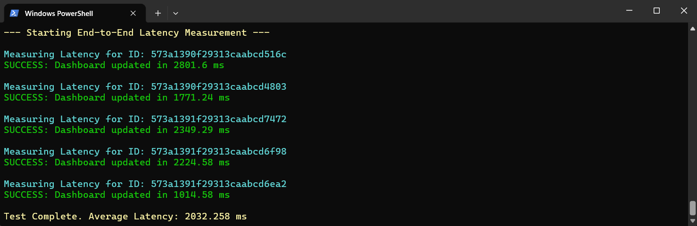
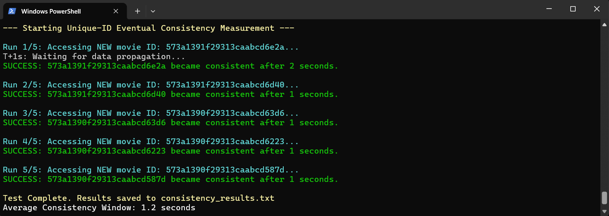
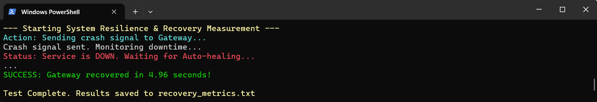

# Real-Time-Analytics-Dashboard

This project implements a distributed Event-Driven Architecture for monitoring resource views (movies) using Google Cloud Platform services.

---

## System Architecture

The system is designed for scalability and resilience and is composed of the following components:

- **Service A (Fast Lazy Bee):** REST API (Cloud Run) acting as the event producer.
- **Google Cloud Pub/Sub:** Asynchronous messaging broker used to decouple microservices.
- **Cloud Function (FaaS):** Event consumer responsible for processing data and ensuring idempotency.
- **BigQuery:** Stateful data warehouse used for OLAP analytics and historical storage.
- **WebSocket Gateway:** Service providing real-time queries and live data streaming to the dashboard.
- **MongoDB Atlas:** Shared stateful database layer storing movie metadata.

---

## Prerequisites and Required Tools

Before starting, ensure the following tools are installed on your local machine:

### 1. Development and Runtime
- Visual Studio Code (or preferred IDE)
- Git (for version control)
- Node.js (v20+)

### 2. Databases and Containers
- MongoDB Community Edition 8.x (for local testing)
- MongoDB Compass + MongoDB Database Tools (including `mongorestore`)
- Docker Desktop (for containerization)

### 3. Cloud and Testing Tools
- Google Cloud SDK (`gcloud`) for managing GCP resources
- cURL / Postman for API testing
- `hey` HTTP load testing tool for performance evaluation

---

## Cloud Environment Setup

### 1. MongoDB Atlas Configuration (Cloud Database)

Instead of using a local MongoDB instance, this project uses **MongoDB Atlas (M0 free tier)** as a shared cloud database. This separation between stateless services (Cloud Run) and a stateful database reflects a production-grade architecture.

#### Steps:

- Create a free account on MongoDB Atlas.
- Create a free **M0 cluster** in the same region as your cloud services (e.g., `us-central1`).
- Configure security:
  - Add a database user with credentials and save the password.
  - In Network Access, allow access from 0.0.0.0/0 (required as Cloud Run IPs are dynamic).
- Retrieve the connection string (e.g., `mongodb+srv://...`) and set it as an environment variable:

```

MONGO_URL=mongodb+srv://<user>:<password>@cluster.mongodb.net/sample_mflix

```

### 2. Project Configuration and APIs

Open Cloud Shell and run the following commands to prepare the infrastructure:

```bash
# Enable required services
gcloud services enable \
  run.googleapis.com \
  pubsub.googleapis.com \
  cloudfunctions.googleapis.com \
  bigquery.googleapis.com \
  artifactregistry.googleapis.com \
  cloudbuild.googleapis.com \
  logging.googleapis.com \
  monitoring.googleapis.com

# Set default region (us-central1)
gcloud config set run/region us-central1
gcloud config set compute/region us-central1
```

---

## BigQuery Configuration (Stateful Service)

* Dataset: Create a dataset named `analytics_db` in the `us-central1` region.

* Table: Create a table named `view_stats` with the following schema:

```json
[
  {"name": "resourceId", "type": "STRING", "mode": "REQUIRED"},
  {"name": "timestamp", "type": "TIMESTAMP", "mode": "REQUIRED"},
  {"name": "eventId", "type": "STRING", "mode": "REQUIRED"},
  {"name": "resourceType", "type": "STRING", "mode": "NULLABLE"}
]
```

---

## Pub/Sub Configuration

Create the messaging topic:

```bash
gcloud pubsub topics create resource-events
```

---

## IAM Permissions Setup (Security)

> NOTE: Replace `[PROJECT_NUMBER]` and `[PROJECT_ID]` with your actual values.
> The numeric project ID is required to identify the Compute Service Account.

```bash
$SA="[PROJECT_NUMBER]-compute@developer.gserviceaccount.com"
```

### BigQuery Permissions

```bash
gcloud projects add-iam-policy-binding [PROJECT_ID] \
  --member="serviceAccount:$SA" \
  --role="roles/bigquery.dataEditor"

gcloud projects add-iam-policy-binding [PROJECT_ID] \
  --member="serviceAccount:$SA" \
  --role="roles/bigquery.jobUser"
```

### Pub/Sub Permissions

```bash
gcloud projects add-iam-policy-binding [PROJECT_ID] \
  --member="serviceAccount:$SA" \
  --role="roles/pubsub.publisher"

gcloud projects add-iam-policy-binding [PROJECT_ID] \
  --member="serviceAccount:$SA" \
  --role="roles/pubsub.subscriber"
```

### Build & Storage Permissions

```bash
gcloud projects add-iam-policy-binding [PROJECT_ID] \
  --member="serviceAccount:$SA" \
  --role="roles/storage.admin"

gcloud projects add-iam-policy-binding [PROJECT_ID] \
  --member="serviceAccount:$SA" \
  --role="roles/cloudbuild.builds.builder"
```

---

## Build and Deployment

### 1. Artifact Registry Setup

Create the repository to host your Docker images:

```powershell
gcloud artifacts repositories create pcd-repo `
    --repository-format=docker `
    --location=us-central1 `
    --description="Docker images repository for the PCD project"
```

### 2. Build Docker Images

```powershell
$PROJECT_ID = "YOUR_PROJECT_ID"t"
$REPO = "us-central1-docker.pkg.dev/$PROJECT_ID/pcd-repo"

gcloud builds submit --tag "$REPO/service-a:v1" ./fast-lazy-bee
gcloud builds submit --tag "$REPO/websocket-gateway:v1" ./websocket-gateway
```

### 3. Deploy Services

#### Service A (Cloud Run)

```powershell
gcloud run deploy service-a `
  --image "$REPO/service-a:v1" `
  --port 3000 `
  --allow-unauthenticated `
  --region us-central1 `
  --platform managed `
  --set-env-vars "MONGO_URL=[URL_ATLAS],GOOGLE_CLOUD_PROJECT=$PROJECT_ID,NODE_ENV=production"
  --min-instances 1 `
  --max-instances 1
```

#### Cloud Function (FaaS)

```powershell
gcloud functions deploy event-processor `
  --runtime nodejs20 `
  --trigger-topic resource-events `
  --entry-point processEvent `
  --region us-central1 `
  --allow-unauthenticated `
  --set-env-vars "GOOGLE_CLOUD_PROJECT=$PROJECT_ID,GATEWAY_URL=[URL_GATEWAY]/notify"
```

#### WebSocket Gateway

```powershell
gcloud run deploy websocket-gateway `
  --image "$REPO/websocket-gateway:v1" `
  --region us-central1 `
  --allow-unauthenticated `
  --session-affinity `
  --timeout=3600 `
  --set-env-vars GOOGLE_CLOUD_PROJECT=$PROJECT_ID
```

---

## Testing and Metrics

To verify that the system functions correctly and follows the proposed architectural principles, we have included several testing utilities in the `scripts` folder. The screenshots below represent our reference runs; you can expect similar results when running these scripts in your own environment.

### 1. Latency Testing (End-to-End)
We use the `test-latency.ps1` script to measure the total time an event takes to travel through the pipeline: Service A → Pub/Sub → Cloud Function → BigQuery → WebSocket Gateway.
* **What to expect:** The first run will be slower due to the "Cold Start" phenomenon (initialization of containers in Google Cloud). Subsequent runs will be significantly faster.
* **Our results:** In our tests, we achieved a stable latency of approximately 1 second after the "warm-up" phase.



### 2. Consistency Window (Eventual Consistency)
The system follows an **AP (Availability & Partition Tolerance)** model, prioritizing availability. The `test_consistency.ps1` script verifies the time needed for data to become consistent across all distributed layers.
* **What to expect:** You will notice a small delay (consistency window) between sending the data and the moment it becomes queryable on the dashboard.
* **Our results:** The average measured window for this synchronization was 1.2 seconds.



### 3. Resilience and Recovery (Auto-healing)
We verified the system's recovery capacity using the `test_recovery.ps1` script, which forces a crash of the Gateway service via the `/crash` endpoint.
* **What to expect:** The script will report that the service is "DOWN," followed by a phase where Google Cloud Run automatically restarts the instance without human intervention.
* **Our results:** The system fully recovered and became functional again in approximately 5 seconds.



### 4. Load Testing (Throughput)
To evaluate performance under pressure, we used the `hey` tool to simulate heavy traffic.
* **Test Example:** `./hey.exe -n 1000 -c 50 https://service-a-url...` (1000 requests with 50 concurrent users).
* We validated that Service A remains available while Pub/Sub acts as a buffer (backpressure management) for the rest of the pipeline.


---

## Resource Cleanup

To avoid unexpected charges, delete the resources once the project is complete:

```poweshell
# Delete Cloud Run services
gcloud run services delete service-a --region us-central1
gcloud run services delete websocket-gateway --region us-central1

# Delete Cloud Function
gcloud functions delete event-processor --region us-central1

# Delete Pub/Sub Topic
gcloud pubsub topics delete resource-events
```
